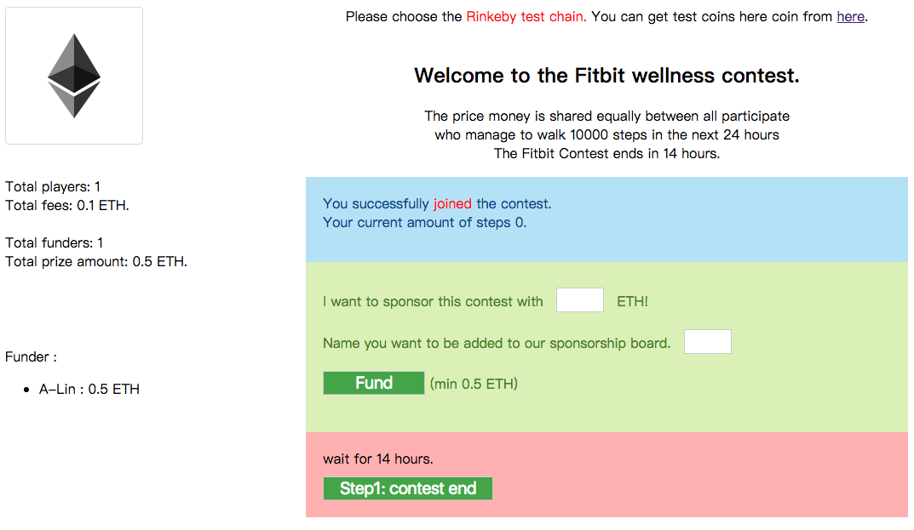

# Fitbit Dapp




## Run it

```
npm i
npm start
```

## build & publish

```sh
npm run build
git add -A && git commit -m "bundle"
git push
```

### Player

* signup

you need to wait 2~3 minute, until oraclize callback. then you could see you are signed.

* playerRefund

if contest end over 3 days, but the owner still not end the contest, the user could click refund button, then get money back.

```
struct Player {
    address addr;
    uint amount;
    string userId;
    uint createdAt;
    uint beginStep;
    uint endStep;
    bool refunded;
    string encryptHeader;
}
```

### Funder

* fund: funder could fund many times, second time will update amount and name.

```
struct Funder {
    address addr;
    uint amount;
    uint createdAt;
    string name;
}
```

### Owner

* Step1: contestDone

it will update all user end step and save the doneAt.

* Step2: award

if will check doneAt, make a sure, you already waiting for 10 minutes. then you can call this function.

it will count all winner and award money to winner.

## Ref

* [Oraclize Documentation](https://docs.oraclize.it/#ethereum-quick-start-simple-query)
* [oraclize/ethereum-examples](https://github.com/oraclize/ethereum-examples/)
