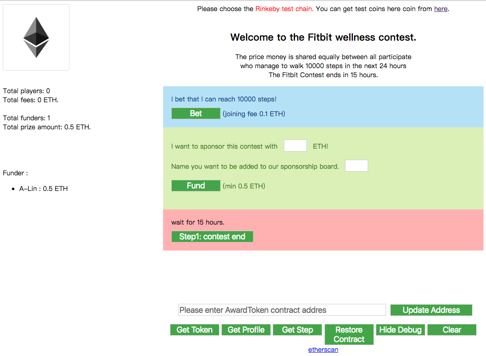
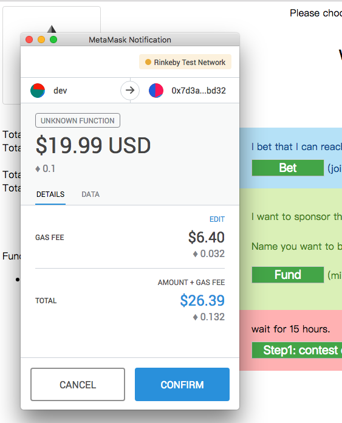

# Fitbit Dapp Workshop
**tutorials**
* [slides - Introduction to fitbit dapp by alincode](https://slides.com/alincode/fitbit-dapp-intro/fullscreen)
* [slides - Introduction to oraclize  by alincode](https://slides.com/alincode/oraclize201810#/)
* [Oraclize Documentation](https://docs.oraclize.it/#ethereum-quick-start-simple-query)

# demo
### 1. player role
* `signup` - you need to wait 2~3 minute until you can see you are signed up
* `playerRefund` - if the contest ends and 3 days after the owner still did not trigger payouts, the user can click the refund button to get their money back

### 2. sponsor role
* `fund` - sponsors can fund many times, additional times will update "amount" and "name"

### 3. owner role
1. `contestDone` - it will update all user end step and save the doneAt.
2. `award` - if will check doneAt, make a sure, you already waiting for 10 minutes. then you can call this function and it will count all winner and award money to winner

https://playproject-io-archive.github.io/workshop-fitbit-dapp/





# contribute
```bash
git clone https://github.com/ethereum-play/workshop-fitbit-dapp.git
cd workshop-fitbit-dapp
npm install
npm start # run livereload dev server
# edit repo
npm run build # build: updates bundle
git add -A && git commit -m "<summary of changes>"
git push # publish
```
